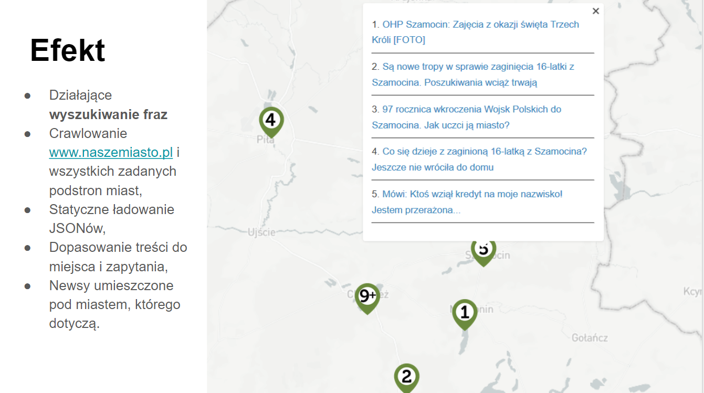

# SW2017
ENG: Project that geographically maps news from polish online news services (naszemiasto.pl) that have distributed news sites for a lot of polish towns. It uses a crawler together with customly made polish lemmatization to extract keywords matching the query over a scrapped news database and visualizes the news in user friendly, Javascript based map:
 - Working crawler for news sites
  - Working Search engine based on TFIDF
 - Working visualization and geographical mapping of news

PL: Projekt który geograficznie mapuje wiadomości z polskich serwisów z wiadomościami (naszemiasto.pl) które posiadają rozproszoną baze stron internetowych dla wielu polskich miast. Program wykorzystuje crawlera wraz z własnoręcznie przygotowaną lematyzacją języka polskiego by otrzymać słowa kluczowe które odpowiadają zapytaniu wykonanemu na "zescrappowanej" bazie danych i wizualizuje wiadomości w przyjaznej dla użytkownika formie mapy - wykonanej za pomocą Javascriptu.

http://www.lexiconista.com/datasets/lemmatization/ - słownik oryginalny
http://sgjp.pl/morfeusz/dopobrania.html.po - drugi slownik zrodlowy plik .tab
Plik z poprawioną lematyzacją dostępny na - https://drive.google.com/open?id=0B2MXzESFn1mtMWhFUzR1M0NYMU0 (nie zmiescil sie na githubie)

Prezentacja jest dostępna na https://drive.google.com/open?id=1wAy3MwQIQ-ytUMLA8GNzMpAb8tAKUzXDWc0a-tqT6G8
